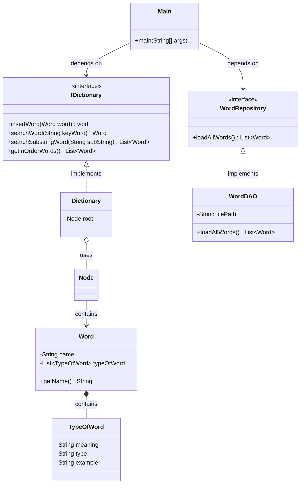

# Báo Cáo Code Review - Nhánh Task-US-1.3

Báo cáo này đánh giá chất lượng mã nguồn hiện tại trên nhánh `Task-US-1.3` dựa trên **5 nguyên lý SOLID** và các tiêu chuẩn thiết kế phần mềm sạch (Clean Code). Đồng thời chỉ ra các lỗi cú pháp gây lỗi biên dịch và các lỗi logic nghiêm trọng phát hiện được trong quá trình review.

---

## 📌 Tóm Tắt Tổng Quan & Trạng Thái

| ID | Vấn đề | Vị trí ảnh hưởng | Mức độ (Severity) | Trạng thái |
| :--- | :--- | :--- | :--- | :--- |
| **1.1** | Lỗi cú pháp gây lỗi biên dịch trong `WordGAO.java` | [WordGAO.java](file:///d:/Students%20Reports/Ngoc/Dictionary/src/repository/impl/WordGAO.java) | 🔴 **High** |  **Đã giải quyết** (Xóa code thừa, sửa thành `WordDAO.java`) |
| **1.2** | Lỗi logic tìm kiếm phân biệt chữ hoa/chữ thường | [Dictionary.java](file:///d:/Students%20Reports/Ngoc/Dictionary/src/models/Dictionary.java) | 🔴 **High** |  **Đã giải quyết** (Chuẩn hóa chữ thường khi so sánh) |
| **2.1** | Vi phạm nguyên lý Đơn Nhiệm (SRP) | Toàn bộ Project | 🟡 **Medium** | ⏳ **Đã giải quyết một phần** (Tách UI khỏi `Dictionary`, Repository không chèn trực tiếp) |
| **2.2** | Vi phạm nguyên lý Đóng/Mở (OCP) | `ExceptionHandler.java`, `Dictionary.java` | 🟡 **Medium** | ❌ **Chưa giải quyết** (Vẫn kiểm tra tĩnh và BST fix cứng comparator) |
| **2.3** | Vi phạm nguyên lý Thay Thế Liskov (LSP) | `WordGAO.java` (nay là `WordDAO.java`) | 🟡 **Medium** |  **Đã giải quyết** (Ném lỗi lên Main thay vì tự nuốt) |
| **2.4** | Vi phạm nguyên lý Phân Tách Giao Diện (ISP) | `WordRepository.java` | 🟡 **Medium** |  **Đã giải quyết** (Repository không nhận tham số `Dictionary`) |
| **2.5** | Vi phạm nguyên lý Đảo Ngược Phụ Thuộc (DIP) | `Main.java`, `WordRepository.java` | 🟡 **Medium** |  **Đã giải quyết** (Khai báo và liên kết qua interface) |
| **3.1** | Rủi ro NullPointerException (NPE) | `Word.java`, `Dictionary.java` | 🟢 **Low** |  **Đã giải quyết** (Thêm kiểm tra an toàn tại Dictionary) |
| **3.2** | Đặt tên lớp và thuộc tính chưa chuẩn | `WordGAO.java` (nay là `WordDAO.java`), `Word.java` | 🟢 **Low** |  **Đã giải quyết** (Đổi tên lớp thành `WordDAO` và trường thành `keyOfWord`) |

---

## 🔴 1. Các Vấn Đề Nghiêm Trọng (Severity: High)

### 1.1. [Đã giải quyết] Lỗi cú pháp gây lỗi biên dịch (Compilation Error) trong `WordGAO.java`
* **Vị trí:** [WordDAO.java](file:///d:/Students%20Reports/Ngoc/Dictionary/src/repository/impl/WordDAO.java) (đã sửa đổi và đổi tên từ `WordGAO.java`)
* **Chi tiết:** File chứa các ký tự đóng ngoặc nhọn `}` thừa và một khối `catch` lạc loài đã được dọn dẹp triệt để.
* **Trạng thái:**  **Đã giải quyết** (Mã nguồn build thành công).

### 1.2. [Đã giải quyết] Lỗi logic tìm kiếm phân biệt chữ hoa/chữ thường trong `Dictionary.searchRec`
* **Vị trí:** [Dictionary.java:L119-132](file:///d:/Students%20Reports/Ngoc/Dictionary/src/models/Dictionary.java#L119-L132)
* **Chi tiết:** Trong phương thức đệ quy tìm kiếm nút cây BST, việc so sánh đã được đồng bộ hóa đưa về chữ thường (`keyWordLower.compareTo(rootWordLower)`) trước khi phân hướng đi trái/phải.
* **Trạng thái:**  **Đã giải quyết** (Đã test tìm kiếm chính xác không phân biệt chữ hoa/thường).

---

## 🟡 2. Vi Phạm Nguyên Lý SOLID (Severity: Medium)

### 2.1. [Đã giải quyết một phần] Vi phạm nguyên lý Đơn Nhiệm (SRP - Single Responsibility Principle)
1. **[Dictionary.java](file:///d:/Students%20Reports/Ngoc/Dictionary/src/models/Dictionary.java) [ĐÃ GIẢI QUYẾT]:**
   - Đã tách Console UI ra khỏi class. Thay vì tự in console bằng `System.out.println`, class cung cấp `getInOrderWords()` và `getReverseInOrderWords()` trả về `List<Word>` để caller tự xử lý phần hiển thị.
2. **[WordDAO.java](file:///d:/Students%20Reports/Ngoc/Dictionary/src/repository/impl/WordDAO.java) [ĐÃ GIẢI QUYẾT]:**
   - Chỉ đảm nhận đọc file JSON và trả về `List<Word>`, không còn trực tiếp chèn dữ liệu vào `Dictionary`.
3. **[ExceptionHandler.java](file:///d:/Students%20Reports/Ngoc/Dictionary/src/exception/ExceptionHandler.java) [CHƯA GIẢI QUYẾT]:**
   - Vẫn thực hiện vừa kiểm tra loại ngoại lệ vừa trực tiếp xuất log lỗi ra console.

### 2.2. [Chưa giải quyết] Vi phạm nguyên lý Đóng/Mở (OCP - Open/Closed Principle)
1. **[ExceptionHandler.java](file:///d:/Students%20Reports/Ngoc/Dictionary/src/exception/ExceptionHandler.java) [CHƯA GIẢI QUYẾT]:**
   - Hàm `handle(Exception e)` dùng `instanceof` kiểm tra tĩnh. Thêm ngoại lệ mới phải sửa mã nguồn của lớp này.
2. **[Dictionary.java](file:///d:/Students%20Reports/Ngoc/Dictionary/src/models/Dictionary.java) [CHƯA GIẢI QUYẾT]:**
   - Thuật toán so sánh của BST bị fix cứng trong code, không cho phép tùy biến bộ so sánh (`Comparator`).

### 2.3. [Đã giải quyết] Vi phạm nguyên lý Thay Thế Liskov (LSP - Liskov Substitution Principle)
* **Chi tiết:** Khi xảy ra lỗi đọc file, `WordDAO` ném ngoại lệ lên `Main.java` thay vì nuốt lỗi. `Main.java` có khối `try-catch` đón nhận và thông báo đúng sự cố tới người dùng, không bị hiện tượng báo thành công ảo.

### 2.4. [Đã giải quyết] Vi phạm nguyên lý Phân Tách Giao Diện (ISP - Interface Segregation Principle)
* **Chi tiết:** Interface `WordRepository` được thiết kế lại chỉ trả về `List<Word>`, loại bỏ hoàn toàn việc phụ thuộc trực tiếp vào tham số `Dictionary`.

### 2.5. [Đã giải quyết] Vi phạm nguyên lý Đảo Ngược Phụ Thuộc (DIP - Dependency Inversion Principle)
* **Chi tiết:** `Main.java` được cấu trúc để tương tác thông qua lớp trừu tượng/Interface `WordRepository` thay vì liên kết trực tiếp với lớp thực thi cụ thể `WordDAO`.

---

## 🟢 3. Các Điểm Chưa Nhất Quán & Khuyến Nghị Khác (Severity: Low)

### 3.1. [Đã giải quyết] Rủi ro NullPointerException (NPE)
* **Chi tiết:** Các hàm thêm và duyệt cây trong [Dictionary.java](file:///d:/Students%20Reports/Ngoc/Dictionary/src/models/Dictionary.java) đã được bổ sung kiểm tra null chủ động trước khi gọi getter.

### 3.2. [Đã giải quyết] Đặt tên lớp chưa chuẩn và thuộc tính chưa chuẩn
* **Chi tiết:** Đã đổi tên lớp `WordGAO` thành `WordDAO`. Tên thuộc tính trong [Word.java](file:///d:/Students%20Reports/Ngoc/Dictionary/src/models/Word.java) đã đổi từ `name` thành `keyOfWord`.

---

## 🛠️ Đề Xuất Mã Nguồn Khắc Phục Chi Tiết

Dưới đây là chi tiết mã nguồn khắc phục cho các lỗi và cải tiến thiết kế SOLID.

### 1. Sửa Lỗi Biên Dịch và Tìm Kiếm (High Severity)

#### 1.1. Sửa file `WordGAO.java` (Xóa code thừa)
Cắt bỏ phần đuôi bị lỗi cú pháp ở cuối file. Đoạn code đúng của file chỉ kết thúc ở dấu đóng ngoặc của class:
```java
// Đoạn kết đúng của file src/repository/impl/WordGAO.java
        // Trường hợp "typeOfWord" không lồng nhau
        return gson.fromJson(json, TypeOfWord.class);
    }
}
```

#### 1.2. Sửa thuật toán tìm kiếm trong `src/models/Dictionary.java`
Thay đổi phương thức `searchRec` để chuyển đổi đồng bộ tất cả về chữ thường khi so sánh định hướng đi trái/phải:
```diff
     private Node searchRec(String keyWord, Node root) {
         if (root == null) {
             return null;
         }
 
-        if (keyWord.compareToIgnoreCase(root.getWord().getName()) == 0) {
+        String keyWordLower = keyWord.toLowerCase();
+        String rootNameLower = root.getWord().getName().toLowerCase();
+
+        int cmp = keyWordLower.compareTo(rootNameLower);
+        if (cmp == 0) {
             return root;
         }
 
-        if (keyWord.compareTo(root.getWord().getName().toLowerCase()) < 0) {
+        if (cmp < 0) {
             return searchRec(keyWord, root.getLeft());
         }
 
         return searchRec(keyWord, root.getRight());
     }
```

---

### 2. Tái Cấu Trúc Áp Dụng SOLID (Medium Severity)

#### 2.1. Phân tách Interface Repository sạch (ISP, DIP, LSP)
Sửa đổi [WordRepository.java](file:///d:/Students%20Reports/Ngoc/Dictionary/src/repository/WordRepository.java) để nó không còn phụ thuộc vào `Dictionary`, đồng thời khai báo ném ngoại lệ rõ ràng:
```java
package repository;

import models.Word;
import java.io.IOException;
import java.util.List;

public interface WordRepository {
    // Trả về danh sách Word thuần túy, ném IOException ra ngoài để Client xử lý
    List<Word> loadAllWords() throws IOException;
}
```

#### 2.2. Triển khai lại `WordDAO.java` sạch (Đổi tên từ `WordGAO`)
Repository chỉ tập trung vào đọc file JSON và ánh xạ sang `List<Word>`, trả ngoại lệ cho nơi gọi:
```java
package repository.impl;

import com.google.gson.*;
import com.google.gson.reflect.TypeToken;
import models.Word;
import models.TypeOfWord;
import repository.WordRepository;

import java.io.FileReader;
import java.io.IOException;
import java.lang.reflect.Type;
import java.util.List;

public class WordDAO implements WordRepository {
    private String filePath;

    public WordDAO(String filePath) {
        this.filePath = filePath;
    }

    @Override
    public List<Word> loadAllWords() throws IOException {
        Gson defaultGson = new Gson();
        Gson gson = new GsonBuilder()
                .registerTypeAdapter(
                        TypeOfWord.class,
                        (JsonDeserializer<TypeOfWord>) (json, type, context) -> parseTypeOfWord(json, defaultGson)
                )
                .create();

        try (FileReader fileReader = new FileReader(filePath)) {
            Type listType = new TypeToken<List<Word>>(){}.getType();
            return gson.fromJson(fileReader, listType);
        }
    }

    private TypeOfWord parseTypeOfWord(JsonElement json, Gson gson) {
        if (!json.isJsonObject()) {
            return gson.fromJson(json, TypeOfWord.class);
        }
        JsonObject obj = json.getAsJsonObject();
        if (obj.has("typeOfWord") && obj.get("typeOfWord").isJsonObject()) {
            return gson.fromJson(obj.get("typeOfWord"), TypeOfWord.class);
        }
        return gson.fromJson(json, TypeOfWord.class);
    }
}
```

#### 2.3. Tách biệt Console UI khỏi `Dictionary.java` (SRP)
Sửa đổi `Dictionary.java` để nó trả về danh sách các từ thay vì tự in ra màn hình.
```java
    // Trả về danh sách thay vì System.out.println
    public List<Word> getInOrderWords() {
        List<Word> result = new ArrayList<>();
        inOrderRec(this.root, result);
        return result;
    }

    private void inOrderRec(Node root, List<Word> result) {
        if (root != null) {
            inOrderRec(root.getLeft(), result);
            result.add(root.getWord());
            inOrderRec(root.getRight(), result);
        }
    }

    public List<Word> getReverseInOrderWords() {
        List<Word> result = new ArrayList<>();
        reverseInOrderRec(this.root, result);
        return result;
    }

    private void reverseInOrderRec(Node root, List<Word> result) {
        if (root != null) {
            reverseInOrderRec(root.getRight(), result);
            result.add(root.getWord());
            reverseInOrderRec(root.getLeft(), result);
        }
    }
```

#### 2.4. Cập nhật `Main.java` điều phối nghiệp vụ
Chuyển việc tương tác Console và xử lý lỗi nạp file về lớp `Main`. Khai báo qua Interface `WordRepository`:
```java
        Dictionary dictionary = new Dictionary();
        // Áp dụng DIP: Khai báo qua Interface WordRepository
        WordRepository wordRepository = new WordDAO("resource/dictionary.json");

        System.out.println("--- ĐANG TẢI DỮ LIỆU TỪ FILE ---");
        try {
            List<Word> words = wordRepository.loadAllWords();
            for (Word word : words) {
                dictionary.insertWord(word);
            }
            System.out.println("Tải thành công!\n");
        } catch (IOException e) {
            System.err.println("Lỗi nghiêm trọng: Không thể đọc file dữ liệu từ điển!");
            e.printStackTrace();
        }
```

Khi in danh sách trong các `case 1` và `case 2` của `Main.java`:
```java
                case 1:
                    System.out.println("===== IN-ORDER =====");
                    List<Word> sortedWords = dictionary.getInOrderWords();
                    for (Word w : sortedWords) {
                        System.out.println(w);
                    }
                    break;
```

---

## 📐 Đề Xuất Sơ Đồ Lớp Hoàn Thiện


