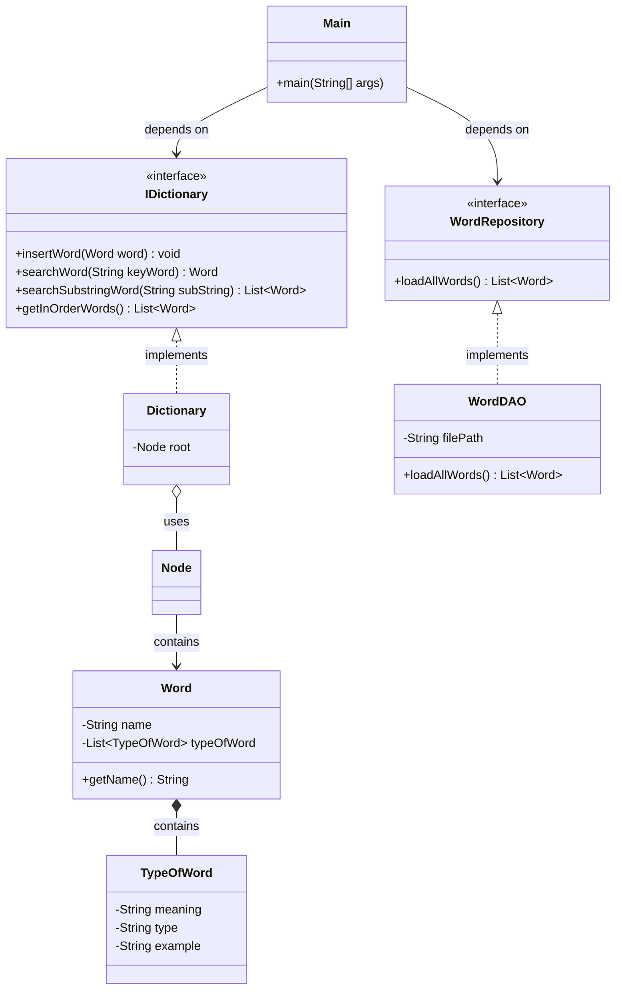

# Báo Cáo Code Review - Nhánh Task-US-1.3

Báo cáo này đánh giá chất lượng mã nguồn hiện tại trên nhánh `Task-US-1.3` dựa trên **5 nguyên lý SOLID** và các tiêu chuẩn thiết kế phần mềm sạch (Clean Code). Đồng thời chỉ ra các lỗi cú pháp gây lỗi biên dịch và các lỗi logic nghiêm trọng phát hiện được trong quá trình review.

---

## 📌 Tóm Tắt Tổng Quan

| Mức Độ Nghiêm Trọng (Severity) | Số Lượng | Mô Tả |
| :--- | :---: | :--- |
| 🔴 **High (Nghiêm trọng)** | 2 | Lỗi biên dịch (cú pháp) và lỗi logic cốt lõi ảnh hưởng trực tiếp đến hoạt động của ứng dụng. |
| 🟡 **Medium (Trung bình)** | 5 | Vi phạm các nguyên lý SOLID (SRP, OCP, LSP, ISP, DIP) gây khó khăn cho việc mở rộng, bảo trì hoặc viết Unit Test. |
| 🟢 **Low (Thấp)** | 2 | Các điểm chưa nhất quán trong code, nguy cơ tiềm ẩn nhỏ hoặc quy chuẩn đặt tên. |

---

## 🔴 1. Các Vấn Đề Nghiêm Trọng (Severity: High)

### 1.1. Lỗi cú pháp gây lỗi biên dịch (Compilation Error) trong `WordGAO.java`
* **Vị trí:** [WordGAO.java:L66-73](file:///d:/Students%20Reports/Ngoc/Dictionary/src/repository/impl/WordGAO.java#L66-L73)
* **Chi tiết:** File chứa các ký tự đóng ngoặc nhọn `}` thừa và một khối `catch` lạc loài nằm ngoài phạm vi bất kỳ phương thức nào ở cuối file.
* **Ảnh hưởng:** Ứng dụng không chạy được.

### 1.2. Lỗi logic tìm kiếm phân biệt chữ hoa/chữ thường trong `Dictionary.searchRec`
* **Vị trí:** [Dictionary.java:L87-95](file:///d:/Students%20Reports/Ngoc/Dictionary/src/models/Dictionary.java#L87-L95)
* **Chi tiết:** Trong phương thức đệ quy tìm kiếm nút cây BST, việc so sánh phân biệt chữ hoa/thường khi định hướng đi trái/phải (`keyWord.compareTo(root.getWord().getName().toLowerCase()) < 0`) làm sai lệch hướng tìm kiếm khi từ khóa có ký tự viết hoa (ví dụ: `Banana` đi sang trái thay vì phải do so sánh mã ASCII của `B` và `a`).
* **Ảnh hưởng:** Tìm kiếm từ khóa có chữ viết hoa sẽ báo không tìm thấy từ dù từ đó có tồn tại.

---

## 🟡 2. Vi Phạm Nguyên Lý SOLID (Severity: Medium)

### 2.1. Vi phạm nguyên lý Đơn Nhiệm (SRP - Single Responsibility Principle)
1. **[Dictionary.java](file:///d:/Students%20Reports/Ngoc/Dictionary/src/models/Dictionary.java):**
   - Đảm nhận in kết quả ra màn hình console bằng `System.out.println` trong các hàm duyệt cây `printInOrder()` và `printReverseInOrder()`.
2. **[WordGAO.java](file:///d:/Students%20Reports/Ngoc/Dictionary/src/repository/impl/WordGAO.java):**
   - Tự cấu hình cấu trúc Gson và trực tiếp chèn dữ liệu vào `Dictionary` thông qua `dictionary.insertWord(word)` thay vì chỉ trả về một danh sách các từ.
3. **[ExceptionHandler.java](file:///d:/Students%20Reports/Ngoc/Dictionary/src/exception/ExceptionHandler.java):**
   - Vừa phân loại ngoại lệ vừa đảm nhận xuất thông tin ra Console.

### 2.2. Vi phạm nguyên lý Đóng/Mở (OCP - Open/Closed Principle)
1. **[ExceptionHandler.java](file:///d:/Students%20Reports/Ngoc/Dictionary/src/exception/ExceptionHandler.java):**
   - Hàm `handle(Exception e)` dùng `instanceof` kiểm tra tĩnh. Thêm ngoại lệ mới phải sửa mã nguồn của lớp này.
2. **[Dictionary.java](file:///d:/Students%20Reports/Ngoc/Dictionary/src/models/Dictionary.java):**
   - Thuật toán so sánh của BST bị fix cứng trong code, không cho phép tùy biến bộ so sánh (`Comparator`).

### 2.3. Vi phạm nguyên lý Thay Thế Liskov (LSP - Liskov Substitution Principle)
* **Chi tiết:** Khi xảy ra lỗi đọc file (`IOException`), `WordGAO` bắt ngoại lệ và lẳng lặng in stack trace. Lớp gọi ở `Main.java` vẫn báo `"Tải thành công!"` dù thực tế từ điển trống rỗng.

### 2.4. Vi phạm nguyên lý Phân Tách Giao Diện (ISP - Interface Segregation Principle)
* **Chi tiết:** Interface `WordRepository` nhận trực tiếp lớp cụ thể `Dictionary` làm tham số trong phương thức `loadFromFile(Dictionary dictionary)`, gây ra liên kết chặt chẽ không đáng có.

### 2.5. Vi phạm nguyên lý Đảo Ngược Phụ Thuộc (DIP - Dependency Inversion Principle)
* **Chi tiết:** `Main.java` phụ thuộc trực tiếp vào lớp cụ thể `WordGAO`. Interface `WordRepository` phụ thuộc trực tiếp vào lớp cụ thể `Dictionary`.

---

## 🟢 3. Các Điểm Chưa Nhất Quán & Khuyến Nghị Khác (Severity: Low)

### 3.1. Rủi ro NullPointerException (NPE)
* Constructor của `Word` gọi `name.toLowerCase()` mà không kiểm tra null, trong khi `getName()` lại kiểm tra null. `searchSubstringWordRec` cũng tiềm ẩn nguy cơ NPE nếu `name` của Word trong cây bị null.

### 3.2. Đặt tên lớp chưa chuẩn
* Đổi tên `WordGAO` thành `WordDAO` hoặc `JsonWordRepository`.

---

## 🛠️ Đề Xuất Mã Nguồn Khắc Phục Chi Tiết

Dưới đây là chi tiết mã nguồn khắc phục cho các lỗi và cải tiến thiết kế SOLID.

### 1. Sửa Lỗi Biên Dịch và Tìm Kiếm (High Severity)

#### 1.1. Sửa file `WordGAO.java` (Xóa code thừa)
Cắt bỏ phần đuôi bị lỗi cú pháp ở cuối file. Đoạn code đúng của file chỉ kết thúc ở dấu đóng ngoặc của class:
```java
// Đoạn kết đúng của file src/repository/impl/WordGAO.java
        // Trường hợp "typeOfWord" không lồng nhau
        return gson.fromJson(json, TypeOfWord.class);
    }
}
```

#### 1.2. Sửa thuật toán tìm kiếm trong `src/models/Dictionary.java`
Thay đổi phương thức `searchRec` để chuyển đổi đồng bộ tất cả về chữ thường khi so sánh định hướng đi trái/phải:
```diff
     private Node searchRec(String keyWord, Node root) {
         if (root == null) {
             return null;
         }
 
-        if (keyWord.compareToIgnoreCase(root.getWord().getName()) == 0) {
+        String keyWordLower = keyWord.toLowerCase();
+        String rootNameLower = root.getWord().getName().toLowerCase();
+
+        int cmp = keyWordLower.compareTo(rootNameLower);
+        if (cmp == 0) {
             return root;
         }
 
-        if (keyWord.compareTo(root.getWord().getName().toLowerCase()) < 0) {
+        if (cmp < 0) {
             return searchRec(keyWord, root.getLeft());
         }
 
         return searchRec(keyWord, root.getRight());
     }
```

---

### 2. Tái Cấu Trúc Áp Dụng SOLID (Medium Severity)

#### 2.1. Phân tách Interface Repository sạch (ISP, DIP, LSP)
Sửa đổi [WordRepository.java](file:///d:/Students%20Reports/Ngoc/Dictionary/src/repository/WordRepository.java) để nó không còn phụ thuộc vào `Dictionary`, đồng thời khai báo ném ngoại lệ rõ ràng:
```java
package repository;

import models.Word;
import java.io.IOException;
import java.util.List;

public interface WordRepository {
    // Trả về danh sách Word thuần túy, ném IOException ra ngoài để Client xử lý
    List<Word> loadAllWords() throws IOException;
}
```

#### 2.2. Triển khai lại `WordDAO.java` sạch (Đổi tên từ `WordGAO`)
Repository chỉ tập trung vào đọc file JSON và ánh xạ sang `List<Word>`, trả ngoại lệ cho nơi gọi:
```java
package repository.impl;

import com.google.gson.*;
import com.google.gson.reflect.TypeToken;
import models.Word;
import models.TypeOfWord;
import repository.WordRepository;

import java.io.FileReader;
import java.io.IOException;
import java.lang.reflect.Type;
import java.util.List;

public class WordDAO implements WordRepository {
    private String filePath;

    public WordDAO(String filePath) {
        this.filePath = filePath;
    }

    @Override
    public List<Word> loadAllWords() throws IOException {
        Gson defaultGson = new Gson();
        Gson gson = new GsonBuilder()
                .registerTypeAdapter(
                        TypeOfWord.class,
                        (JsonDeserializer<TypeOfWord>) (json, type, context) -> parseTypeOfWord(json, defaultGson)
                )
                .create();

        try (FileReader fileReader = new FileReader(filePath)) {
            Type listType = new TypeToken<List<Word>>(){}.getType();
            return gson.fromJson(fileReader, listType);
        }
    }

    private TypeOfWord parseTypeOfWord(JsonElement json, Gson gson) {
        if (!json.isJsonObject()) {
            return gson.fromJson(json, TypeOfWord.class);
        }
        JsonObject obj = json.getAsJsonObject();
        if (obj.has("typeOfWord") && obj.get("typeOfWord").isJsonObject()) {
            return gson.fromJson(obj.get("typeOfWord"), TypeOfWord.class);
        }
        return gson.fromJson(json, TypeOfWord.class);
    }
}
```

#### 2.3. Tách biệt Console UI khỏi `Dictionary.java` (SRP)
Sửa đổi `Dictionary.java` để nó trả về danh sách các từ thay vì tự in ra màn hình.
```java
    // Trả về danh sách thay vì System.out.println
    public List<Word> getInOrderWords() {
        List<Word> result = new ArrayList<>();
        inOrderRec(this.root, result);
        return result;
    }

    private void inOrderRec(Node root, List<Word> result) {
        if (root != null) {
            inOrderRec(root.getLeft(), result);
            result.add(root.getWord());
            inOrderRec(root.getRight(), result);
        }
    }

    public List<Word> getReverseInOrderWords() {
        List<Word> result = new ArrayList<>();
        reverseInOrderRec(this.root, result);
        return result;
    }

    private void reverseInOrderRec(Node root, List<Word> result) {
        if (root != null) {
            reverseInOrderRec(root.getRight(), result);
            result.add(root.getWord());
            reverseInOrderRec(root.getLeft(), result);
        }
    }
```

#### 2.4. Cập nhật `Main.java` điều phối nghiệp vụ
Chuyển việc tương tác Console và xử lý lỗi nạp file về lớp `Main`. Khai báo qua Interface `WordRepository`:
```java
        Dictionary dictionary = new Dictionary();
        // Áp dụng DIP: Khai báo qua Interface WordRepository
        WordRepository wordRepository = new WordDAO("resource/dictionary.json");

        System.out.println("--- ĐANG TẢI DỮ LIỆU TỪ FILE ---");
        try {
            List<Word> words = wordRepository.loadAllWords();
            for (Word word : words) {
                dictionary.insertWord(word);
            }
            System.out.println("Tải thành công!\n");
        } catch (IOException e) {
            System.err.println("Lỗi nghiêm trọng: Không thể đọc file dữ liệu từ điển!");
            e.printStackTrace();
        }
```

Khi in danh sách trong các `case 1` và `case 2` của `Main.java`:
```java
                case 1:
                    System.out.println("===== IN-ORDER =====");
                    List<Word> sortedWords = dictionary.getInOrderWords();
                    for (Word w : sortedWords) {
                        System.out.println(w);
                    }
                    break;
```

---

## 📐 Đề Xuất Sơ Đồ Lớp Hoàn Thiện


